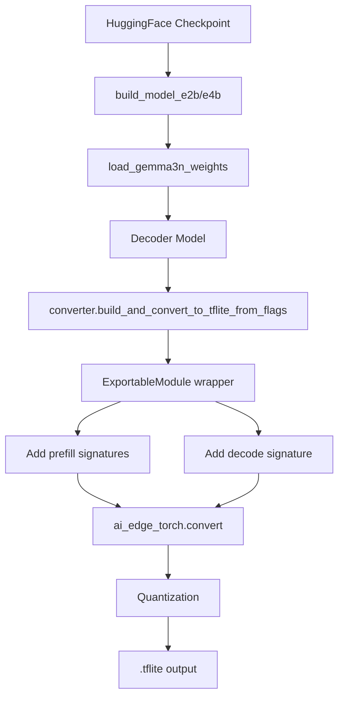

# Gemma 3n Implementation Walkthrough

This document provides a comprehensive guide to the Gemma 3n (Matformer) implementation in AI Edge Torch, including the architecture, conversion process, and implementation details.

## Table of Contents

1. [Overview](#overview)
2. [Architecture Background](#architecture-background)
3. [Implementation Structure](#implementation-structure)
4. [Conversion Pipeline](#conversion-pipeline)
5. [Component Details](#component-details)
6. [Usage Guide](#usage-guide)
7. [Known Limitations](#known-limitations)
8. [References](#references)

---

## Overview

Gemma 3n is Google's **Matformer (Matryoshka Transformer)** architecture designed for efficient on-device inference. This implementation enables conversion of Gemma 3n models to TFLite format for deployment on edge devices via MediaPipe's LLM Inference API.

### Supported Model Variants

| Variant | Layers | Embedding Dim | Intermediate Size | Description |
|---------|--------|---------------|-------------------|-------------|
| **E2B** | 30 | 2048 | 8192 | ~2 billion parameters |
| **E4B** | 35 | 2048 | 16384 | ~4 billion parameters |

---

## Architecture Background

Gemma 3n introduces several novel mechanisms that differentiate it from standard transformers:

### 1. AltUp (Alternating Updates)

**Reference**: [arxiv.org/pdf/2301.13310](https://arxiv.org/pdf/2301.13310)

AltUp enables sparse updates across multiple prediction streams, reducing computational cost while maintaining model expressivity. Instead of processing a single hidden state, AltUp maintains multiple parallel "streams" and only fully processes one at a time.

```
Input Hidden States → [num_altup_inputs, batch, seq_len, hidden_size]
                     ↓
              Predict Step (expand predictions using learned coefficients)
                     ↓
              Process Active Stream (attention + FFN)
                     ↓
              Correct Step (propagate updates to other streams)
                     ↓
Output Hidden States → [num_altup_inputs, batch, seq_len, hidden_size]
```

### 2. LAuReL (Learned Augmented Residual Layer)

**Reference**: [arxiv.org/pdf/2411.07501](https://arxiv.org/pdf/2411.07501)

LAuReL provides more expressivity than simple additive residuals through a low-rank projection:

```
input → Linear(hidden_size → laurel_rank) → Linear(laurel_rank → hidden_size) → RMSNorm → + input
```

### 3. Per-Layer Embeddings (PLE)

Each transformer layer receives additional token-specific embeddings that provide layer-specific information. This allows the model to retrieve context on-demand rather than encoding everything in the initial embedding.

```
Token IDs → Embedding(vocab_size → num_layers * per_layer_dim)
         → reshape to [batch, seq_len, num_layers, per_layer_dim]
```

### 4. Hybrid Attention

Gemma 3n uses a mix of:
- **Local Sliding Window Attention** (window_size=512) for most layers
- **Global Full Attention** for every 5th layer

This pattern balances computational efficiency with long-range context modeling.

---

## Implementation Structure

### File Organization

```
ai_edge_torch/generative/examples/gemma3n/
├── __init__.py                    # Module exports
├── gemma3n.py                     # Core model implementation (973 lines)
└── convert_gemma3n_to_tflite.py   # Conversion script
```

### Key Classes and Functions

| Component | Location | Purpose |
|-----------|----------|---------|
| `RMSNorm` | gemma3n.py:151 | RMS normalization layer |
| `LaurelBlock` | gemma3n.py:168 | LAuReL residual connection |
| `AltUp` | gemma3n.py:190 | Alternating updates module |
| `PerLayerEmbedding` | gemma3n.py:280 | Per-layer embedding lookup |
| `Gemma3nDecoderBlock` | gemma3n.py:323 | Single decoder layer |
| `Decoder` | gemma3n.py:459 | Full decoder model |
| `build_model_e2b` | gemma3n.py:921 | E2B model builder |
| `build_model_e4b` | gemma3n.py:948 | E4B model builder |
| `load_gemma3n_weights` | gemma3n.py:70 | Custom weight loader |

---

## Conversion Pipeline

### Step-by-Step Conversion Flow



### 1. Model Building

The conversion starts by calling the model builder function:

```python
from ai_edge_torch.generative.examples.gemma3n import gemma3n

# Build the model from a checkpoint
pytorch_model = gemma3n.build_model_e2b(checkpoint_path)
```

Internally, `build_model_e2b` performs:

1. **Get configuration**: Calls `get_model_config_e2b()` to create `ModelConfig` and `gemma3n_config` dict
2. **Instantiate model**: Creates `Decoder(model_config, gemma3n_config)`
3. **Build mask cache**: If `mask_cache_size > 0`, pre-builds causal attention mask
4. **Load weights**: Calls `load_gemma3n_weights(model, checkpoint_path)`
5. **Set eval mode**: `model.eval()`

### 2. Weight Loading

The `load_gemma3n_weights` function handles the complete mapping from HuggingFace checkpoint format to our internal structure:

```python
# HuggingFace format → Our format
"model.layers.{i}.self_attn.q_proj.weight" → "transformer_blocks.{i}.atten_func.qkv_projection.weight" (fused with K, V)
"model.layers.{i}.mlp.gate_proj.weight" → "transformer_blocks.{i}.ff.w1.weight"
"model.layers.{i}.laurel.linear_left.weight" → "transformer_blocks.{i}.laurel.linear_left.weight"
"model.layers.{i}.altup.correction_coefs.weight" → "transformer_blocks.{i}.altup.correction_coefs.weight"
```

Key transformations:
- **QKV fusion**: Q, K, V projections are concatenated into a single `qkv_projection`
- **Norm naming**: `input_layernorm` → `pre_atten_norm`
- **Laurel/AltUp**: Direct mapping with prefix change

### 3. Conversion to TFLite

The conversion uses the standard AI Edge Torch converter:

```python
from ai_edge_torch.generative.utilities import converter

converter.build_and_convert_to_tflite_from_flags(builder)
```

This function:

1. **Builds the model** with the provided builder function
2. **Creates sample inputs** for each signature:
   - Prefill signatures: `(tokens, input_pos, kv_cache, [mask])`
   - Decode signature: `(tokens, input_pos, kv_cache, [mask])`
3. **Wraps the model** in `ExportableModule` to capture extra kwargs
4. **Adds signatures** to the converter for each prefill length and decode
5. **Applies quantization** based on the `--quantize` flag
6. **Exports** to `.tflite` file

### 4. Signature Structure

The output TFLite model contains multiple signatures:

| Signature Name | Input Shape | Purpose |
|----------------|-------------|---------|
| `prefill_8` | tokens: [1, 8], input_pos: [8] | Short prefill |
| `prefill_64` | tokens: [1, 64], input_pos: [64] | Medium prefill |
| `prefill_128` | tokens: [1, 128], input_pos: [128] | Default prefill |
| ... | ... | Additional prefill lengths |
| `decode` | tokens: [1, 1], input_pos: [1] | Single token decode |

---

## Component Details

### Decoder Forward Pass

The `Decoder.forward` method orchestrates the full inference:

```python
def forward(self, tokens, input_pos, kv_cache, mask=None, export_config=None):
    # 1. Token embedding with scaling
    input_embeds = self.tok_embedding(tokens)
    input_embeds = input_embeds * self.config.embedding_scale  # sqrt(embedding_dim)
    
    # 2. Compute per-layer inputs (PLE)
    per_layer_inputs = self.get_per_layer_inputs(tokens, input_embeds)
    
    # 3. Expand hidden states for AltUp
    hidden_states = self.expand_hidden_states(input_embeds)
    # Shape: [num_altup_inputs, batch, seq_len, hidden_size]
    
    # 4. Build RoPE embeddings for each layer
    rope_list = [build_rope(input_pos, head_dim, rotary_base) for each layer]
    
    # 5. Process through transformer blocks
    for i, block in enumerate(self.transformer_blocks):
        hidden_states, kv = block(
            hidden_states, rope_list[i], mask_list[i], 
            input_pos, kv_cache[i], per_layer_inputs[:,:,i,:]
        )
    
    # 6. Collapse AltUp hidden states
    hidden_states = self.collapse_hidden_states(hidden_states)
    
    # 7. Final norm and logit computation
    hidden_states = self.final_norm(hidden_states)
    logits = self.lm_head(hidden_states)
    
    # 8. Apply logit softcapping
    logits = tanh(logits / 30.0) * 30.0
    
    return {"logits": logits, "kv_cache": updated_kv_cache}
```

### Decoder Block Forward Pass

Each `Gemma3nDecoderBlock` performs:

```python
def forward(self, hidden_states, rope, mask, input_pos, kv_cache, per_layer_input):
    # 1. AltUp predict step
    predictions = self.altup.predict(hidden_states)
    active_prediction = predictions[0]  # active_idx = 0
    
    # 2. Pre-attention norm + LAuReL
    active_normed = self.pre_atten_norm(active_prediction)
    laurel_output = self.laurel(active_normed)
    
    # 3. Self-attention
    attn_out, kv = self.atten_func(active_normed, rope, mask, input_pos, kv_cache)
    attn_out = self.post_atten_norm(attn_out)
    
    # 4. Combine attention with LAuReL
    attn_gated = active_prediction + attn_out
    attn_laurel = (attn_gated + laurel_output) / sqrt(2)
    
    # 5. Feed-forward with pre/post norms
    ff_input = self.pre_ff_norm(attn_laurel)
    ff_out = self.ff(ff_input)
    ff_out = self.post_ff_norm(ff_out)
    attn_ff = attn_laurel + ff_out
    
    # 6. AltUp correct step
    corrected = self.altup.correct(predictions, attn_ff)
    
    # 7. Apply per-layer embeddings to non-active predictions
    gate = gelu(self.per_layer_input_gate(corrected[0] * scale))
    per_layer_out = self.per_layer_projection(gate * per_layer_input)
    per_layer_out = self.post_per_layer_norm(per_layer_out)
    corrected[1:] += per_layer_out  # Add to non-active streams
    
    return corrected, kv
```

---

## Usage Guide

### Basic Conversion

```bash
python -m ai_edge_torch.generative.examples.gemma3n.convert_gemma3n_to_tflite \
    --checkpoint_path=/path/to/gemma3n-e2b \
    --output_path=/output/directory \
    --model_variant=e2b \
    --quantize=dynamic_int8 \
    --kv_cache_max_len=1280 \
    --prefill_seq_lens=8,64,128,256
```

### Programmatic Usage

```python
from ai_edge_torch.generative.examples.gemma3n import gemma3n
from ai_edge_torch.generative.utilities import converter
from ai_edge_torch.generative.utilities.export_config import ExportConfig
from ai_edge_torch.generative.layers import kv_cache

# Build the model
pytorch_model = gemma3n.build_model_e2b("/path/to/checkpoint")

# Configure export
export_config = ExportConfig()
export_config.kvcache_layout = kv_cache.KV_LAYOUT_TRANSPOSED
export_config.mask_as_input = True

# Convert
converter.convert_to_tflite(
    pytorch_model,
    output_path="/output/directory",
    output_name_prefix="gemma3n-e2b",
    prefill_seq_len=[8, 64, 128],
    kv_cache_max_len=1280,
    quantize="dynamic_int8",
    export_config=export_config,
)
```

### Conversion Flags

| Flag | Default | Description |
|------|---------|-------------|
| `--checkpoint_path` | ~/Downloads/llm_data/gemma3n-e2b | Path to model checkpoint |
| `--output_path` | /tmp/ | Output directory |
| `--model_variant` | e2b | Model variant: 'e2b' or 'e4b' |
| `--quantize` | dynamic_int8 | Quantization type |
| `--kv_cache_max_len` | 1280 | Maximum KV cache length |
| `--prefill_seq_lens` | 8,64,128,256,512,1024 | Prefill sequence lengths |
| `--mask_as_input` | True | Pass mask as input |
| `--transpose_kv_cache` | True | Use transposed KV cache layout |

---

## Known Limitations

> [!WARNING]
> This implementation is experimental and has the following limitations:

1. **Text-only support**: This implementation only supports the text decoder. Vision and audio encoders from the full Gemma 3n model are not included.

2. **KV cache sharing**: The config includes `num_kv_shared_layers` but the current implementation does not implement KV cache sharing between layers. Each layer maintains its own KV cache.

3. **Activation sparsity**: The `activation_sparsity_pattern` config is defined but not applied during inference. The full activation sparsity from the original implementation would require additional optimization.

4. **No verification against reference**: The implementation has not been verified against the original HuggingFace implementation for numerical accuracy.

5. **Weight loading assumes specific format**: The weight loader expects HuggingFace SafeTensors format. Other checkpoint formats may require modifications.

---

## References

### Architecture Papers

- **MatFormer**: [https://arxiv.org/pdf/2310.07707](https://arxiv.org/pdf/2310.07707)
- **LAuReL**: [https://arxiv.org/pdf/2411.07501](https://arxiv.org/pdf/2411.07501)
- **AltUp**: [https://arxiv.org/pdf/2301.13310](https://arxiv.org/pdf/2301.13310)

### Source Files

- [gemma3n.py](ai_edge_torch/generative/examples/gemma3n/gemma3n.py) - Main model implementation
- [convert_gemma3n_to_tflite.py](ai_edge_torch/generative/examples/gemma3n/convert_gemma3n_to_tflite.py) - Conversion script
- [converter.py](ai_edge_torch/generative/utilities/converter.py) - Conversion utilities
- [references/gemma3n-hf/](references/gemma3n-hf/) - HuggingFace reference implementation

### Related Examples

- [Gemma 3 implementation](ai_edge_torch/generative/examples/gemma3/) - Similar architecture without Matformer components
- [Examples README](ai_edge_torch/generative/examples/README.md) - Overview of all model examples
